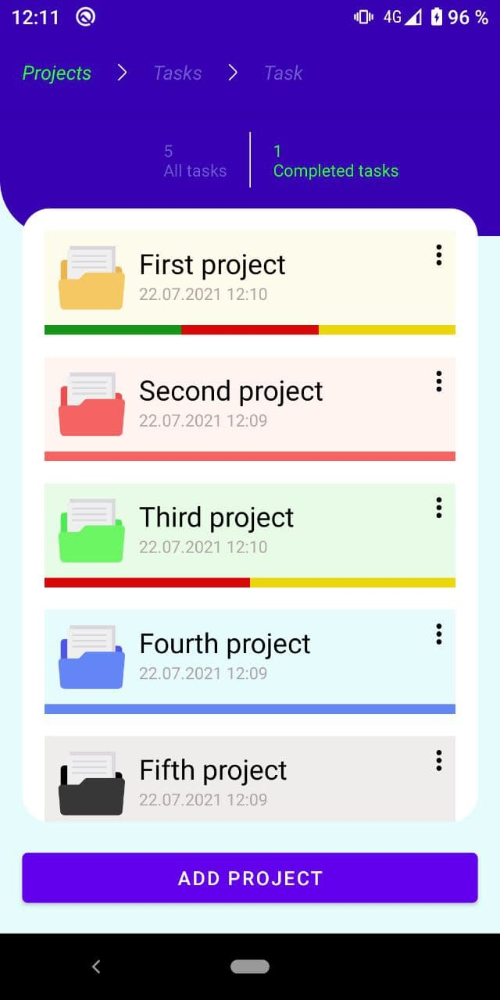
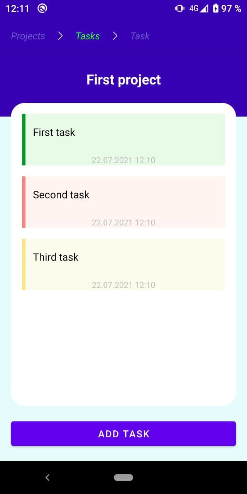
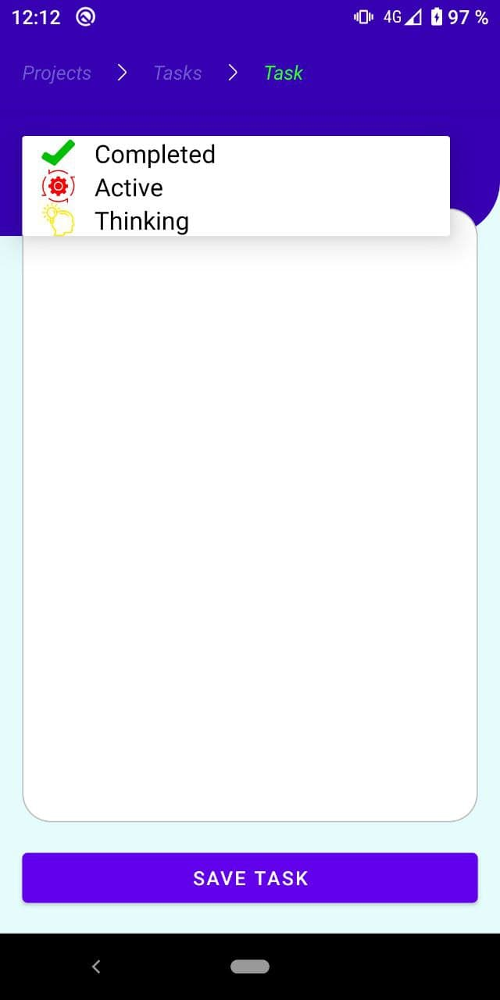

# ProjectStages
ProjectStages is a simple application with three screens for creating projects and a task list for them. Tasks can be of three types: completed, active and thinking.
## Screenshots
  

## Architecture
This application is based on the MVI architecture principle. The application has an Interactor middleware. The role of this layer is in Coroutine context switching and wrapping the result of a database query in a ResultWrapper class (ex. Kotlin Result). MutableStateFlow and Channel (for single-events) are used to deliver events to the View-layer. The ViewBinding library is used to work with the View-layer. The ViewModel gets Flow from the Interactor to automatically monitor changes in the Room database.

More details about View and ViewModel interaction:

